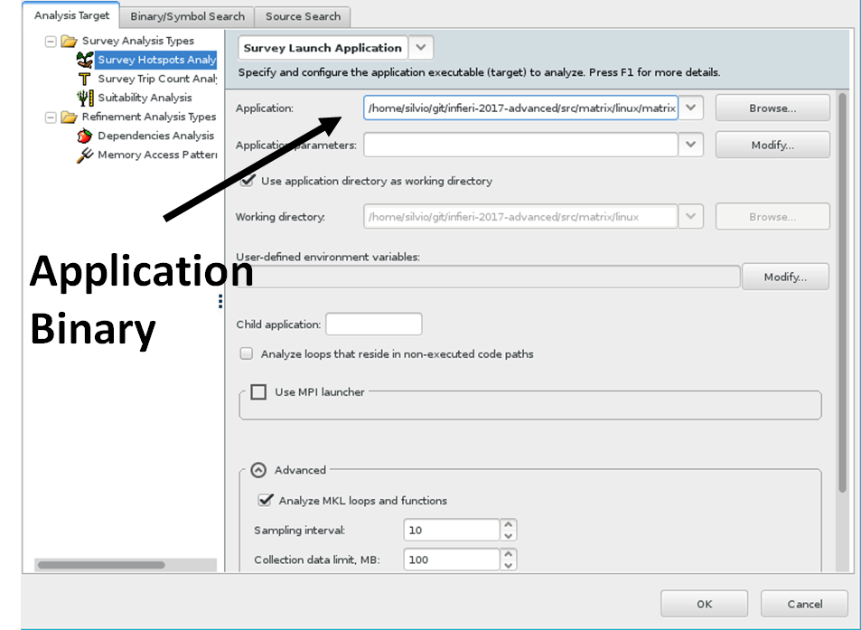
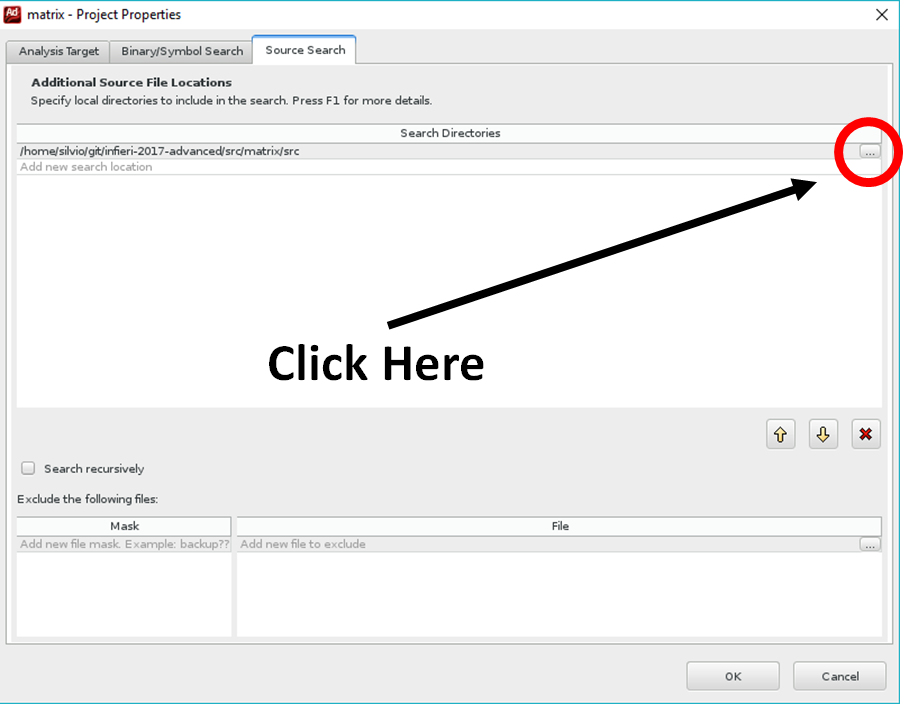
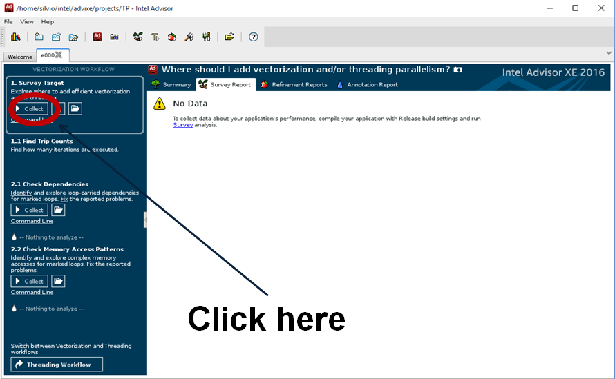
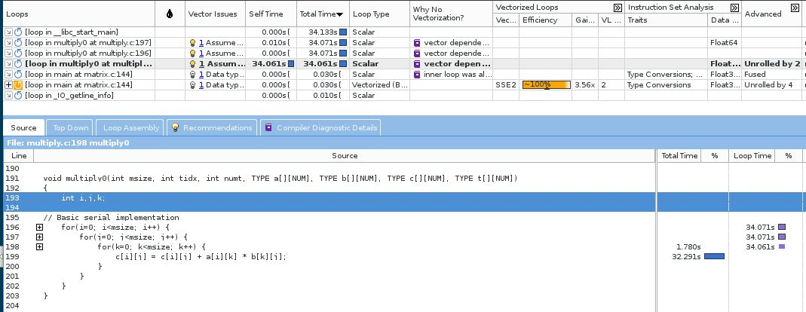
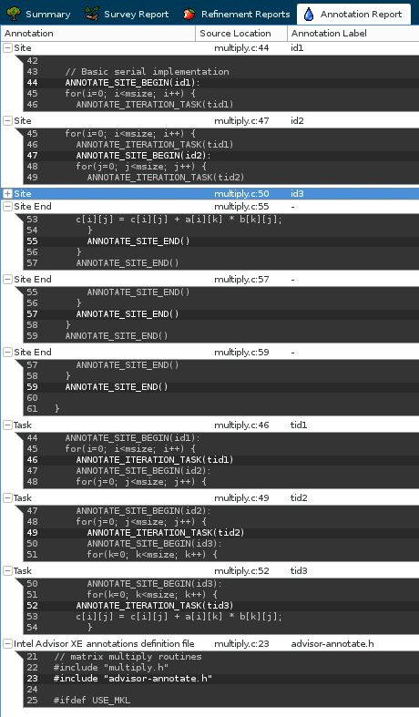
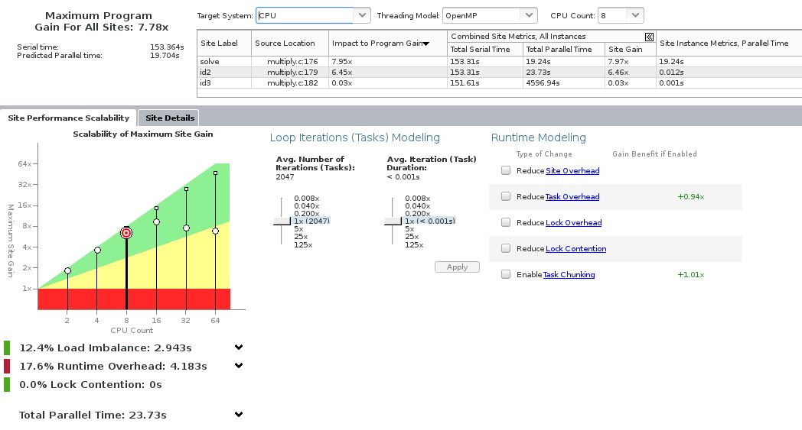
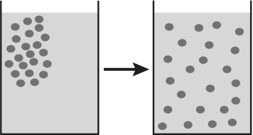
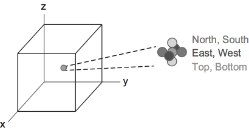

<a name="top"></a>

# 4rd International Summer School on INtelligent Signal Processing for FrontIEr Research and Industry

## Lab Workbook - Session 2 (CL6)

**January 2017**

UNESP Center for Scientific Computing (an Intel Modern Code Partner)  
São Paulo State University (Universidade Estadual Paulista - UNESP)

São Paulo, Brazil 

**Organized by: Rogério Iope, Silvio Stanzani, Raphael Cóbe, Jefferson Fialho**

______

## Overview

The Intel Xeon Phi Coprocessor, the first product of Intel’s Many
Integrated Core (MIC) Architecture, is a new accelerator technology
developed by Intel to enable performance gains for highly parallel
computing workloads. It possesses several interesting and appealing
features, including the ability to use familiar programming models such
as OpenMP and MPI. This hands-on training session is a comprehensive,
practical introduction to the Xeon Phi architecture and programming
models, aiming to demonstrate the processing power of the Intel Xeon Phi
product family.

Participants will have access to a heterogeneous computing system
equipped with Intel Xeon processors and Intel Xeon Phi coprocessors, as
well as Intel software development tools. The computing system, a
state-of-the-art server with two Intel Xeon processors (16 cores, 2
threads/core) and three Intel Xeon Phi coprocessors (171 cores, 4
threads/core), is hosted at the Center for Scientific Computing of the
São Paulo State University (UNESP), in Brazil. The step-by-step hands-on
activities have been planned to provide easy to follow instructions in
order to allow the participants to have a real - though very
introductory - experience on using a powerful manycore system.

## Learning Goals

Attendants of these hands-on labs will start issuing simple command-line
tools to get basic information about the Intel Xeon Phi coprocessors,
then will learn how to monitor what resources are being used and access
their operating systems by establishing ssh sessions with them. Trainees
will thus verify that the Intel Xeon Phi coprocessor is an
IP-addressable PCIe device - managed by an independent environment
provided by the MIC Platform Software Stack (MPSS) - that runs the Linux
operating system.

Following the introductory part, participants will learn how to compile
and run simple C/C++ applications directly into the coprocessors, and
then compile and run example codes based on shared-memory parallelism
with OpenMP and Cilk Plus and distributed-memory parallelism with MPI.
They will also work on MPI application examples that should be executed
simultaneously on the Xeon processors and the Xeon Phi coprocessors,
explore the use of Intel Math Kernel Library (MKL), and develop insights
on tuning parallel applications.

______

## Navigation ##

This course is divided into four parts:

* [Practical Exercises - **Part 1**: Task parallelism using OpenMP and Cilk Plus](#part1)
* [Practical Exercices - **Part 2**: Intel MPI programming models](#part2)
* [Practical Exercices - **Part 3**: Using Intel Math Kernel Library (MKL)](#part3)
* [Practical Exercices - **Part 4**: Optimizing a real-world code example](#part4)

______

## Useful References

- _Intel Xeon Phi Coprocessor High-Performance Programming, by Jim Jeffers and James Reinders (Elsevier, 2013)_  
<http://www.lotsofcores.com/>

- _Intel Xeon Phi Coprocessor Architecture and Tools, by Rezaur Rahman (Apress, 2013)_  
<http://www.apress.com/9781430259268>

- _Parallel Programming and Optimization with Intel Xeon Phi
    Coprocessors, 2nd Edition (Colfax, 2015)_
<http://www.colfax-intl.com/nd/xeonphi/book.aspx>

- _An Overview of Programming for Intel Xeon processors and Intel Xeon Phi coprocessors_  
<http://software.intel.com/sites/default/files/article/330164/an-overview-of-programming-for-intel-xeon-processors-and-intel-xeon-phi-coprocessors.pdf>

- _Intel Xeon Phi Coprocessor Developer´s Quick Start Guide_  
<http://software.intel.com/sites/default/files/article/335818/intel-xeon-phi-coprocessor-quick-start-developers-guide.pdf>

- _Intel Xeon Phi Coprocessor: System Software Developers Guide_  
<http://www.intel.com/content/www/us/en/processors/xeon/xeon-phi-coprocessor-system-software-developers-guide.html>

- _Intel C++ Compiler XE 13.1 User and Reference Guide (Linux OS)_  
<http://software.intel.com/sites/products/documentation/doclib/stdxe/2013/composerxe/compiler/cpp-lin/>

- _Tutorial on OpenMP - Lawrence Livermore National Laboratory_  
<https://computing.llnl.gov/tutorials/openMP/>

- _Tutorial on MPI - Lawrence Livermore National Laboratory_  
<https://computing.llnl.gov/tutorials/mpi/>


## Remote access to the testing platform

This document assumes that the testing platform has been setup and is
ready to use. We will be using a state-of-the-art server - loaned by
Intel - with two Intel Xeon processors (16 cores, 2 threads/core) and
three Intel Xeon Phi coprocessors (171 cores, 4 threads/core), as well
as several Intel software development tools. To simplify nomenclature,
we will refer to the testing platform as “the host” (or “the host
system”), and the Xeon Phi coprocessors installed in the host system as
“mic0”, “mic1”, and “mic2”.

Participants should work alone or in pairs on a workstation - preferably
running Linux or Mac - with Internet access. All the exercises are
command-line based and should be executed on the host system by means of
a secure shell (SSH) connection. Ideally the participant workstation
should be able to run X11.

Use the syntax below to log in to the host system.

```
$ ssh –X phi02.ncc.unesp.br –l traineeN
```

**(N is a number assigned to each participant)**

**Note:** Before starting the lab exercises make sure that the Xeon Phi
coprocessors are up and running `status = ‘online’`:

```
[phi02]$ micctrl --status
```
this command shows the status of all MIC cards installed on the host system. 

Please refer to the teaching assistant(s) if you have any question.
______

### Quick Navigation ###

[Top](#top "Top of the page") | [Part 1](#part1 "Task parallelism using OpenMP and Cilk Plus") | [Part 2](#part2 "Intel MPI programming models") | [Part 3](#part3 "Using Intel Math Kernel Library (MKL)") | [Part 4](#part4 "Optimizing a real-world code example") | [Bottom](#bottom "Bottom of the page")

______

<a name="part1"></a>

# Practical Exercises - Part 1

## Task parallelism using OpenMP and Cilk Plus

### 1.1 Goals

In the first part of Session 2 we set focus on multi-threaded
programming, or task parallelism, using the Intel Open Multi-Processing
(OpenMP) and Intel Cilk Plus parallel libraries. While POSIX threads[^1]
- also known as Pthreads - can be used to implement parallelism in
shared memory multiprocessor architectures, this programming interface
does not contain HPC-specific features such as workload balancing,
processor affinity, reducers, etc. Computationally intensive algorithms
in general perform better when implemented using one of the specialized
standards for building thread-parallel applications, such as OpenMP or
Cilk Plus. Moreover, OpenMP and Cilk Plus are a good way of introducing
parallelism in existing sequential programs, providing the programmer
with a mostly declarative style of programming where all the
parallelization is handled at the compiler level.

## 1.2 Overview of OpenMP

OpenMP is a traditional, well-established cross-platform standard with
which many high performance application developers are familiar. It
provides high-level abstraction for task parallelism, and eliminates the
low-level details of iteration space partitioning, data sharing, and
thread creation, scheduling, and synchronization. In order to
parallelize an application with OpenMP, the programmer supplements the
code with OpenMP pragma directives[^2]. These pragmas instruct
OpenMP-aware compilers to produce parallel versions of the respective
statements and to bind to the OpenMP implementation. It is possible to
disable OpenMP support in the compiler, and the code with OpenMP pragmas
will still compile. In this case the pragmas will be treated as simple
comments, and parallelization will not occur - the program will still
yield correct behavior, but without any parallelism.

A program with OpenMP directives begins execution as a single thread,
called the initial thread of execution. It is executed sequentially
until the first parallel construct is encountered. After that the
initial thread creates a team of threads to be executed in parallel, and
becomes the master of this team. All program statements enclosed by the
parallel construct are executed in parallel by each thread in the team,
including all routines called from within the enclosed statements. At
the end of the parallel construct each thread wait for others to arrive.
When that happens the team is dissolved, and only the master thread
continues execution of the code following the parallel construct. The
other threads in the team enter a wait state until they are needed to
form another team.

In order to compile a C/C++ program with OpenMP pragmas using the Intel
C++ Compiler the programmer must specify the compiler argument -openmp.
Without this argument, the code will still compile, but all code will be
executed with only one thread. In order to make certain functions and
variables of the OpenMP library available, the directive `#include <omp.h>` must be used at the beginning of the code.

### 1.2 Overview of Cilk Plus

Cilk Plus is an extension to the C and C++ programming languages,
designed for multithreaded parallel computing, making it easier to write
parallel programs that exploit the multiple processors and vector
instructions available on modern processors[^3]. It is an emerging
standard currently supported by gcc 4.7 or above and the Intel C++
Compiler. Its functionality and scope of application are similar to
those of OpenMP; however, it is distinguished by its focus on minimal
but sufficient support for parallelism in C and C++. The three main
keywords in the Cilk Plus standard are `_Cilk_for`, `_Cilk_spawn` and
`_Cilk_sync`. They allow for the implementation of a variety of parallel
algorithms. Programming for Intel Xeon Phi coprocessors may also require
the keywords `_Cilk_shared` and `_Cilk_offload`. Language extensions
such as array notation, hyperobjects, elemental function and `#pragma simd` are also part of Intel Cilk Plus.

Unlike OpenMP, the Cilk Plus standard guarantees that serialized code
will produce the same results as parallel code, if the program has a
deterministic behavior. It is designed to seamlessly integrate
vectorization and thread-parallelism in applications using this
framework. The nature of Intel Cilk Plus keywords and semantics
preserves the serial nature of codes. With this framework, the
programmer should focus on exposing the parallelism in the application
rather than optimizing low-level aspects such as thread creation, work
distribution and data sharing. Cilk Plus uses an efficient scheduling
algorithm based on “work stealing”, which may be more efficient than
OpenMP in complex multi-program applications.

Cilk Plus also implements array notation, a method for specifying slices
of arrays or whole arrays in a simple way, and applying element-wise
operations to arrays of the same shape. The Intel C++ Compiler
implements these operations using vector code, mapping data-parallel
constructs to the SIMD hardware.

OpenMP and Cilk Plus have the same scope of application to parallel
algorithms and similar functionality. The choice between OpenMP and Cilk
Plus as the parallelization method may be dictated either by
convenience, or by performance considerations. It is often easy enough
to implement the code with both frameworks and compare the performance.
In general, trivial and highly parallel algorithms should run equally
well in any of these two parallel frameworks. For complex algorithms
with nested parallelism and heterogeneous tasks, Cilk Plus generally
provides good performance, but offers little freedom for fine-tuning; in
contrast, OpenMP may require more tuning to perform well; however, it
allows more control over scheduling and work distribution. Additionally,
Intel OpenMP and Intel Cilk Plus libraries can be used side by side in
the same code without conflicts. In case of nested parallelism, it is
preferable to use Cilk Plus parallel regions inside OpenMP parallel
regions, and not the other way around.

In order to make certain functions of Intel Cilk Plus available, the
preprocessing directive `#include <cilk/cilk.h>` must be used at
the beginning of the code.

### 1.3 Hands-on Activities

**Note:** The following set of activities is mainly based on exercises
extracted from this excellent book: _"Parallel Programming and Optimization with Intel Xeon Phi Coprocessors"_ (Colfax International,
2013, pp. 285-290).

**1.3.1** To help you recall how to compile and execute an OpenMP code,
have a look at the source code `openmp.c`, located at
`/home/traineeN/source-files/session2`, which prints out the total number
of OpenMP threads and for each fork-join branch prints out **“Hello world from thread %d"**. Compile the code using `icc` for the Xeon processor and
for the Xeon coprocessor, using the appropriate flag `-openmp` to enable
OpenMP. Before running it, set the environment variable
`OMP_NUM_THREADS` to a number N between 1 and the maximum number of
threads available either on the host or on the coprocessor, using the
command:

```
$ export OMP_NUM_THREADS=N 
```

**(you need to assign a value to N!)**

Execute the binary code and make sure that you understand how it works.
Recompile the source using the -mmic flag, upload the binary to one of
the coprocessors, connect to it using ssh and run the executable there
(do not forget to define `OMP_NUM_THREADS=N` on the Xeon Phi command
shell before launching the executable).

Test yourself by answering these trivial questions:

-   What OpenMP function returns the total number of available threads?

-   What OpenMP function returns the current thread number?

**1.3.2** Modify the source code `openmp.c` by inserting a parallel for
loop that prints out the current thread number and the number of
iteration. Use the directive `#pragma omp for` (**hint:** `#pragma omp parallel` spawns a group of threads, while `#pragma omp for` divides
loop iterations between the spawned threads; you can do both things at
once with the fused `#pragma omp parallel for` directive). Save the
modified source as `openmp_v1.c`, compile and execute the binary on the
host system, checking the result. Recompile the source using the `-mmic`
flag, upload the corresponding binary to one of the coprocessors,
connect to it using ssh and execute it there.

**1.3.3** Have a look at source file `openmp_v2.c`. In this slightly
modified version, constant variable `nthreads` is initialized with the
maximum value of OpenMP threads and is made available for all threads.
Notice that a private integer has been defined, which should be
independent for each parallel region. Any variable declared inside the
parallel region is private to each thread, and any variable declared
before the parallel region is available (`shared`) for every thread.
Compile and execute the code on the host system, and check the result.
Recompile the source using the `-mmic` flag, upload the binary to one of
the coprocessors, connect to it using ssh and execute there.

**1.3.4** Control over the variables scope can also be done with OpenMP
parallel clauses `private`, `shared`, and `firstprivate`. Have a look at the
source file `openmp_v3.c`, which uses these three variables. Check what
values will be assigned to them within the parallel region and how they
will react to the modifications of their values. Then compile the source
and execute on the host system, and check if your assumptions were
correct. Recompile using the `-mmic` flag, upload the object to one of the
coprocessors, connect to it using ssh and execute there a few times.
Notice that the value of `varShared` is different at each execution; in
fact, its value is unpredictable. Why does this happen?

**1.3.5** A common mistake when implementing parallel algorithms is
creating racing conditions, which occur when shared variables are
accessed for reading and writing by different threads at the same time.
Have a look at the source file `openmp_v4.c`, which uses a parallel for
loop over the sequence of N = 10000 numbers added together in a shared
variable sum. Correct value should be equal to `(N−1)*N/2` (note: lower
and upper boundaries of the loop are, respectively, 0 and N–1). Compile
the source code using the `-mmic` flag, upload the executable file to one
of the coprocessors, connect to it using ssh and execute the binary
several times, comparing the results. Why the result is different at
each execution?

**1.3.6** There are several ways to fix racing conditions in OpenMP
parallel codes. One of them is applying `#pragma omp critical` to the
region where the racing conditions occur. Take a look at file
`openmp_v5.c`, which is an example that uses this solution to fix the
summation problem. It should be noted, however, that only one thread
will execute the critical region marked with the critical pragma at a
time. Therefore, the parallel code technically becomes serial, since
only one thread will be executing it at a time. As always, compile the
source for the MIC architecture, upload and execute it several times on
one of the coprocessors, and check the results.

**1.3.7** `Reduction` is a clause of OpenMP for loop, which indicates
what operation will be used on what reduction variable. OpenMP will
automatically take care of avoiding racing conditions and receiving
correct result. Have a look at example `openmp_v6.c`, which implements
the proposed solution. Compile it, execute and check the result.

**1.3.8** In this exercise you will be introduced to a source code that
uses Intel Cilk Plus parallelism model. Have a look at source file
`cilk_v0.cpp`. It prints out the total number of Intel Cilk Plus
workers available on the system. The keyword `_Cilk_for` is used to
iterate through the number of available workers and to print out the
current worker number. Since the workload is very light, all iteration
should be done by only one worker (this ‘for loop’ gets serialized).
Therefore, we need to add extra workload to the ‘for loop’ to see Intel
Cilk Plus parallelism. For this reason, within the ‘for loop’ there is
an additional ‘while loop’ that multiplies some numbers to the private
variable. At the end the code prints out the current worker number
responsible for the previous calculation. Compile `cilk_v0.cpp` using
either `icc` or `icpc` generating binaries for the host and the
coprocessors, execute them on the host and analyze the output. Recompile
the source using the `-mmic` flag, upload the binary to one of the
coprocessors, connect to it using ssh and run the executable there.

**1.3.9** In the previous exercise we used the `_Cilk_for` loop to to
iterate through the number of available workers and to print out the
current worker number. If the workload was significant for each worker,
than each of them should have been involved in the calculations only
once. The number of iterations distributed among the workers can be
controlled by the clause `#pragma cilk grainsize`. In this exercise the
original code has been modified to grant 4 iteration steps for each
worker. Have a look at source file `cilk_v1.cpp`, compile it for host
and coprocessors and execute the binaries on the host and on one of the
coprocessors, and analyze the outputs.

**1.3.10** Using the keyword `_Cilk_spawn` for asynchronous parallelism
we can run recursive tasks in parallel. Have a look at source
`cilk_v2.cpp`, which recursively calls function Recurse(const int task)
and prints out the number of current worker, doing some calculations
within the function. Like in the previous exercises, compile (host and
coprocessor) and execute the binaries on the host and on one of the
coprocessors, and analyze the outputs.

**1.3.11** Quite often we need synchronization between the parallel
tasks. Intel Cilk Plus has `_Cilk_sync` keyword for this. In source code
`cilk_v3.cpp`, a thousand dynamically allocated consecutive integer
elements of an array are summed up by two parallel (`_Cilk_spawn`)
function calls named `Sum()`, each operating over one half of the array. A
synchronization keyword is then used to wait for sums to complete, and
the final result is printed out. Compile (host and coprocessor) and
execute the binaries on the host and on one of the coprocessors, and
analyze the outputs. Modify the code in such a way that the array is
divided in four parts.

**1.3.12** A more elegant way to organize parallelism is to avoid
hardwiring the number of parallel tasks and let Intel Cilk Plus take
care of this automatically. To prevent racing conditions we will use one
of the Intel Cilk Plus reducers named `reducer_opadd`, a math operator
that calculates the sum of a set of values. By definition, a reducer is
a variable that can be safely used by multiple threads running in
parallel. Intel Cilk Plus ships with a library of reducers you can use
in your C and C++ code. The `reducer_opadd` is defined as:

```
cilk::reducer_opadd<int> sum
```

Have a look at source code cilk_v4.c, which uses reducer `sum` to
store the result of adding 20 consecutive integers iterated over with
`_Cilk_for` loop, which is then printed out. Access to the reducer sum
is done through calls to `sum.set_value(N)` and `sum.get_value()`
functions. Compile the source code for host and coprocessors, execute
the binaries on the host and on one of the coprocessors, and analyze the
corresponding outputs.

### 1.4 Hands-on Activities about Profiling 

The next set of exercises will show how to identify parallel opportunities on the code and perform estimates about performance gains before parallelizing, using a profiler tool called Intel® Advisor XE.

Intel® Advisor XE is a shared memory threading designing and prototyping tool for C, C++, C# and Fortran. This tool supports basic profiling to identify time spent in each line of code and also provides a mechanism to estimate performance gains on sequential code. Such estimate is done using a mechanism called annotation, that is used to mark loops which could be parallelized for profiling. Based on such annotations a model is built in order to compare the performance scaling of different threading designs without the cost and disruption of implementation. 

In this set of exercises, you will execute the following steps in order to perform threading prototyping:
- 	Create new advisor project to evaluate a code that performs matrix multiplication;
- 	Discover opportunities for parallelization, using “Survey Data” Analysis;
- 	Include annotations on source code to check scalability;
- 	Evaluate the performance of annotated loops in different architectures and frameworks, using “Check Suitability” analysis.

**1.4.1** The application that we are going to profile is a basic matrix multiplication serial application. Showed below

```
void multiply0(int msize, int tidx, int numt, TYPE a[][NUM], TYPE b[][NUM], TYPE c[][NUM], TYPE t[][NUM])
{ 
  int i,j,k;

  // Basic serial implementation
  for(i=0; i<msize; i++) {
    for(j=0; j<msize; j++) {
      for(k=0; k<msize; k++) {
	c[i][j] = c[i][j] + a[i][k] * b[k][j];
      }
    }
  } 
}
```


This code is on the directory

```
<git_dir>/matrix/src
```

In order to compile the application go to 

```
<git_dir>/matrix/linux
```

and execute 

```
make clean 
make icc
```

**1.4.2** Execute Intel Advisor on terminal: 

```
advixe-gui
```

**1.4.3** Choose “Create New Project” (Figure 1) and use the following parameters (Figure 2, Figure 3 and Figure 4):

- name: matrix
- application: <git_dir>/matrix/linux/matrix.icc
- Source Folder: <git_dir>/matrix/src
 

Figure 1. Create New Project

 
Figure 2. Setup Project Name
 

Figure 3. Setup Application binary and parameters.
 

Figure 4. Setup Source Directory.

**1.4.4** After create the project start the Survey target analysis (Figure 5).

 
Figure 5.Start Survey Target Analysis.

The Survey Target report shows basic profiling information, such as the time spent in each line of the code. This information is useful to identify the parallel opportunities (Figure 5).
 

Figure 6. Survey Target Report

**1.4.5** In some cases, the code presents several parallel opportunities. In our example there are four points in the code that spends too much time: main function and the three loops of function multiply0 that performs the matrix multiplication. In this scenario, we will use the Suitability Analysis to estimate for each loop identified in survey target analysis the performance gains after parallelizing those loops.

This evaluation is done through the following steps:
- Include annotations on candidate loops that will be evaluated;
- Recompile application, linking with advisor library;
- Run “collect suitability” analysis.

**1.4.6**  The three loops of this function presents high execution time, so to identify the best candidates loop to parallelize, we will annotate all the loops

The annotations have to be included in the following way:

- #include "advisor-annotate.h“: include header file
- ANNOTATE_SITE_BEGIN(id): before beginning of loop;
- ANNOTATE_ITERATION_TASK(id): first line inside the loop;
- ANNOTATE_SITE_END(): after end of loop;

Red Lines shows the lines that has to be included in original source code;

```
void multiply0(int msize, int tidx, int numt, TYPE a[][NUM], TYPE b[][NUM], TYPE c[][NUM], TYPE t[][NUM])
{ 
  int i,j,k;

  // Basic serial implementation
ANNOTATE_SITE_BEGIN(id1):
  for(i=0; i<msize; i++) {
ANNOTATE_ITERATION_TASK(tid1)
ANNOTATE_SITE_BEGIN(id2):
    for(j=0; j<msize; j++) {
             ANNOTATE_ITERATION_TASK(tid2)
             ANNOTATE_SITE_BEGIN(id3):
      for(k=0; k<msize; k++) {
	ANNOTATE_ITERATION_TASK(tid3)
	c[i][j] = c[i][j] + a[i][k] * b[k][j];
      }
             ANNOTATE_SITE_END()
    }
    ANNOTATE_SITE_END()
  }  
    ANNOTATE_SITE_END()
}
```

After include these lines recompile application:

```
cd <git_dir>/matrix/linux
make clean
make icc
```

Check your annotations on “view annotations” options;



Start Check Suitability

The Check Suitability Expected Results 
 
Notice that considering OpenMP the two first loops presents similar time but the scalability of outer loop is higher. Considering OpenMP or cilk plus on CPU.  



What loop presents higher scalability?

______

### Quick Navigation ###

[Top](#top "Top of the page") | [Part 1](#part1 "Task parallelism using OpenMP and Cilk Plus") | [Part 2](#part2 "Intel MPI programming models") | [Part 3](#part3 "Using Intel Math Kernel Library (MKL)") | [Part 4](#part4 "Optimizing a real-world code example") | [Bottom](#bottom "Bottom of the page")

______

<a name="part2"></a>

# Practical Exercises - Part 2

## Intel MPI programming models

#### 2.1 Goals

This set of exercises will show you practical aspects of heterogeneous
execution of parallel application in distributed memory with MPI, widely
recognized as the de facto standard for parallel programming.

### 2.2 Overview of MPI

The Message Passing Interface (MPI) has been the de facto standard for
parallel programming for nearly two decades. It defines a set of library
routines that can be called from C and Fortran programs, and includes a
communication protocol that allows multiple processes, which do not
share common memory, to perform parallel calculations, communicating
with each other by passing messages through a communication channel. MPI
messages are arrays of predefined and user-defined data types. The
purpose of MPI messages range from task scheduling to exchanging large
amounts of data necessary to perform calculations. MPI guarantees that
the order of sent messages is preserved on the receiver side.

In the old era of single-core compute nodes, the dominant MPI usage
model in clusters of computers was to run one MPI process per physical
machine. Nowadays, with the advent of multi-core, multi-socket, and now
heterogeneous many-core systems, the range of usage models of MPI has
grown. It is possible, for example, to run one MPI process per compute
node, exploiting parallelism in each machine by means of a shared-memory
parallel framework, such as OpenMP or Intel Cilk Plus. Alternatively,
one single-threaded MPI process can run on each physical or logical core
of each machine in a cluster of servers. In this case, MPI processes
running on the same compute node still do not share memory address
space. However, message passing between these processes is more
efficient, because fast virtual fabrics can be used for communication.
Another possible option is to run multiple multi-threaded MPI processes
per compute node. In this case, each process exploits parallelism in
shared memory, and MPI communication between processes adds
distributed-memory parallelism. This hybrid approach may yield optimum
performance for with a high frequency or large volume of communication.

MPI programs typically employ a single-program, multiple-data (SPMD)
approach. Multiple instances, or MPI ranks, of the same program run
concurrently on different data. Each rank computes a different part of a
larger problem and uses MPI calls to communicate data between ranks.
From the programmer's perspective, ranks may run either on the same node
or in different nodes; the communication path may be different but that
is transparent to the MPI program.

As we have seen in Session 1, Intel Xeon Phi coprocessors run its own
operating system, independent of the host processor, and have their own
memory domain. In other words, a Xeon Phi coprocessor behaves like an
independent compute node. From this perspective, MPI is a natural fit.
In principle, any existing MPI program can be run on a mixture of hosts
and coprocessors without source code modification.

In heterogeneous clusters with Intel Xeon processors and Xeon Phi
coprocessors, MPI programmers have a choice of running MPI processes on
hosts and coprocessors natively, or running MPI processes only on hosts
and performing offload to coprocessors.

### 2.3 Hands-on Activities

**2.3.1** Please review exercises 2.2.6 to 2.2.8 from Session 1. As we
have seen, MPI applications must be compiled with special wrapper
applications – `mpiicc` for C and `mpiicpc` for C++, and the resulting
executable is launched using the `mpirun` script.

**2.3.2** Intel MPI distribution includes a test directory, which
contains a simple MPI program coded in C, C++, or Fortran. In directory
`/home/traineeN/source-files/session2` you will find a copy of the
source file `test.c` from the Intel MPI distribution. Let us start
working on this code as a quick remind on how to run an MPI program on
the Intel Xeon Phi coprocessor. Compile the source file with the Intel
compiler for the host with the usual Intel MPI wrapper:

```
[phi02]$ mpiicc -o test test.c
```

Now compile the source file for Intel Xeon Phi coprocessor using the
`-mmic` compiler flag. Because of this flag the Intel MPI script will
provide the Intel MPI libraries for Intel Xeon Phi coprocessor to the
linker (add the verbose flag `-v` to see it):

```
[phi02]$ mpiicc -mmic -o test.mic test.c
```

The ".mic" suffix is added to distinguish the coprocessor binary from
the host one (it could be any suffix). As a starter run the Xeon binary
with 4 MPI processes alone:

```
[phi02]$ mpirun -n 4 ./test
```

Copy the binary file `test.mic` to the three coprocessors and run the
Intel MPI test program on each of them in coprocessor-only mode.

**Note:** before launching the command below, we need to set the
`I_MPI_MIC` environment variable to enable the MPI communication between
host and coprocessors; please review exercise 2.2.8 in session 1).

```
[phi02]$ mpirun -host mic0 –n 4 ./test.mic
```

An alternative would be to login onto the coprocessor and run the test
from there in a straightforward manner. Try it if you like.

Pulling it together: you can run the test code on both the host
processor and on one of the Xeon Phi coprocessor as one MPI program in
symmetric mode by defining each argument set independently (with command
line sections separated by a colon):

```
[phi02]$ mpirun -host localhost -n 4 ./test : -host mic0 -n 8 \~/test.mic
```

Notice that in the symmetric mode you must provide the `-host` flag for
the MPI processes running on the Xeon host!

**2.3.3** As a preparation for the next exercises on hybrid programming,
the mapping/pinning of Intel MPI processes will be investigated step by
step. Set the environment variable `I_MPI_DEBUG` equal or larger than 4
to see the mapping information:

```
[phi02]$ export I_MPI_DEBUG=4
```

For pure (non-hybrid) MPI programs the environment variable
`I_MPI_PIN_PROCESSOR_LIST` controls the mapping/pinning. For hybrid
codes the variable `I_MPI_PIN_DOMAIN` takes precedence. It splits the
(logical) processors into non-overlapping domains for which this rule
applies: "one MPI process for one domain".

Repeat the Intel MPI test from before with `I_MPI_DEBUG` set. Because of
the amount of output use the flag "-prepend-rank", which puts the MPI
rank number in front of each output line:

```
[phi02]$ mpirun -prepend-rank -n 4 ./test
[phi02]$ mpirun -prepend-rank -host mic0 -n 4 \~/test.mic
[phi02]$ mpirun -prepend-rank -host localhost -n 4 ./test : -host mic0 -n 8 \~/test.mic
```

Sorting of the output can be beneficial for the mapping analysis,
although this changes the order of the output. Try adding `2>&1 | sort` to sort the output if you like.

Now set the variable `I_MPI_PIN_DOMAIN` with the `-env` flag. Possible
values are `auto`, `omp` (which relies on the `OMP_NUM_THREADS`
variable), or a fixed number of logical cores. We have learned before
(session 1, exercise 2.2.4) that by exporting `I_MPI_PIN_DOMAIN` in the
host’s command shell, the variable is identically exported to the host
and to the Xeon Phi coprocessors. Typically this is not beneficial and
an architecture adapted setting using `-env` is recommended:

```
[phi02]$ mpirun -prepend-rank -env I_MPI_PIN_DOMAIN auto -n 4 ./test
[phi02]$ mpirun -prepend-rank -env I_MPI_PIN_DOMAIN auto -host mic0 -n 4 ./test.mic
[phi02]$ mpirun -prepend-rank -env I_MPI_PIN_DOMAIN 4 -host localhost -n 2 ./test : -env I_MPI_PIN_DOMAIN 12 -host mic0 -n 4 \~/test.mic
```

Experiment with pure Intel MPI mapping by setting
`I_MPI_PIN_PROCESSOR_LIST` if you like. (See the Intel MPI reference
manual for details).

**2.3.4** Now we are going to run a hybrid MPI/OpenMP program on the
Intel Xeon Phi coprocessor. Have a look at the source code
`test_openmp.c`, in which a simple printout from the OpenMP threads was
added to the previous Intel MPI test code. You can compare the
difference between the two files by means of the diff utility:

```
[phi02]$ diff test.c test_openmp.c
```

Compile with the `-openmp` compiler flag and upload to the Intel Xeon
Phi coprocessor as usual:

```
[phi02]$ mpiicc -openmp test_openmp.c -o test_openmp
[phi02]$ mpiicc -openmp -mmic test_openmp.c -o test_openmp.mic
```

Because of the `-openmp` flag, Intel MPI will link the code with the
thread-safe version of the Intel MPI library `libmpi_mt.so` by default.
Run the Intel MPI tests from before:

```
[phi02]$ unset I_MPI_DEBUG
[phi02]$ mpirun -prepend-rank -n 2 ./test_openmp
[phi02]$ mpirun -prepend-rank -host mic0 -n 2 \~/test_openmp.mic
[phi02]$ mpirun -prepend-rank -host localhost -n 2 ./test_openmp : -host mic0 -n 4 \~/test_openmp.mic
```
  
The execution generates a lot of output! The default for the OpenMP
library is to assume as many OpenMP threads as there are logical
processors. For the next steps, explicit `OMP_NUM_THREADS` values
(different on host and Intel Xeon Phi coprocessor) will be set.

In the following test the default OpenMP affinity is checked. Please
notice that the range of logical processors is always defined by the
splitting the threads based on the `I_MPI_PIN_DOMAIN` variable. This
time we also use `I_MPI_PIN_DOMAIN=omp`, see how it depends on the
`OMP_NUM_THREADS` setting:

```
[phi02]$ mpirun -prepend-rank -env KMP_AFFINITY verbose -env OMP_NUM_THREADS 4 -env I_MPI_PIN_DOMAIN auto -n 2 ./test_openmp 2&gt;&1 | sort
[phi02]$ mpirun -prepend-rank -env KMP_AFFINITY verbose -env OMP_NUM_THREADS 4 -env I_MPI_PIN_DOMAIN omp -host mic0 -n 2 \~/test_openmp.mic 2>&1 | sort
[phi02]$ mpirun -prepend-rank -env KMP_AFFINITY verbose -env OMP_NUM_THREADS 4 -env I_MPI_PIN_DOMAIN 4 -host localhost -n 2 ./test_openmp : -env KMP_AFFINITY verbose -env OMP_NUM_THREADS 6 -env I_MPI_PIN_DOMAIN 12 -host mic0 -n 4 \~/test_openmp.mic 2>&1 | sort
```

Remember that it is usually beneficial to avoid splitting of logical
cores on Intel Xeon Phi coprocessor between MPI processes; either the
number of MPI processes should be chosen so that
`I_MPI_PIN_DOMAIN=auto` creates domains which cover complete cores or
the environment variable should be a multiply of 4.

Use `scatter`, `compact`, or `balanced` (Intel Xeon Phi coprocessor
specific) to modify the default OpenMP affinity.

```
[phi02]$ mpirun -prepend-rank -env KMP_AFFINITY verbose,granularity=thread,scatter -env OMP_NUM_THREADS 4 -env I_MPI_PIN_DOMAIN auto -n 2 ./test_openmp
[phi02]$ mpirun -prepend-rank -env KMP_AFFINITY verbose,granularity=thread,compact -env OMP_NUM_THREADS 4 -env I_MPI_PIN_DOMAIN omp -host mic0 -n 2 \~/test_openmp.mic 2>&1 | sort
[phi02]$ mpirun -prepend-rank -env KMP_AFFINITY verbose,granularity=thread,compact -env OMP_NUM_THREADS 4 -env I_MPI_PIN_DOMAIN 4 -host localhost -n 2 ./test_openmp : -env KMP_AFFINITY verbose,granularity=thread,balanced -env OMP_NUM_THREADS 6 -env I_MPI_PIN_DOMAIN 12 -host mic0 -n 4 \~/test_openmp.mic 2>&1 | sort
```

Notice that, as well as other options, the OpenMP affinity can be set
differently per Intel MPI argument set, i.e. different on the host and
on the Intel Xeon Phi coprocessor.

**2.3.5** Now we want to run the Intel MPI test program with some
offload code on the Xeon Phi coprocessor. Have a look at source file
`test_offload.c`, in which the simple printout from the OpenMP thread
is now offloaded to the coprocessor. Compare the difference between the
two files using the diff utility:

```
[phi02]$ diff test.c test_offload.c
```

Compile for the Xeon host with the `-openmp` compiler flag as before.
The Intel compiler will automatically recognize the offload pragma and
create the binary for it.

```
[phi02]$ mpiicc -openmp test_offload.c -o test_offload
```

(Note that, if necessary, offloading could be switched off with the
`-no-offload` flag).

Execute the binary on the host:

```
[phi02]$ mpirun -prepend-rank -env KMP_AFFINITY granularity=thread,scatter -env OMP_NUM_THREADS 4 -n 2 ./test_offload
```  

Now repeat the execution, but ‘grep’ and ‘sort’ the output to focus on
the essential information:

```
[phi02]$ mpirun -prepend-rank -env KMP_AFFINITY granularity=thread,scatter -env OMP_NUM_THREADS 4 -n 2 ./test_offload 2>&1 | grep bound | sort
```

All OpenMP threads are mapped onto identical Intel Xeon Phi coprocessor
threads! The variable `I_MPI_PIN_DOMAIN` cannot be used because the
domain splitting would be calculated according to the number of logical
processors on the Xeon host!

The solution is to specify explicit proclists per MPI process:

```
[phi02]$ mpirun -prepend-rank -env KMP_AFFINITY granularity=thread,proclist=\[1-16:4\],explicit -env OMP_NUM_THREADS 4 -n 1 ./test_offload : -env KMP_AFFINITY granularity=thread,proclist=\[17-32:4\],explicit -env OMP_NUM_THREADS 4 -n 1 ./test_offload
```

Repeat the execution, but `grep` and `sort` the output to focus on the
essential information:

```
[phi02]$ mpirun -prepend-rank -env KMP_AFFINITY granularity=thread,proclist=\[1-16:4\],explicit -env OMP_NUM_THREADS 4 - n 1 ./test_offload : -env KMP_AFFINITY granularity=thread,proclist=\[17-32:4\],explicit -env OMP_NUM_THREADS 4 -n 1 ./test_offload 2>&1 | grep bound | sort
```
______

### Quick Navigation ###

[Top](#top "Top of the page") | [Part 1](#part1 "Task parallelism using OpenMP and Cilk Plus") | [Part 2](#part2 "Intel MPI programming models") | [Part 3](#part3 "Using Intel Math Kernel Library (MKL)") | [Part 4](#part4 "Optimizing a real-world code example") | [Bottom](#bottom "Bottom of the page")

______


<a name="part3"></a>

# Practical Exercises - Part 3

## Using Intel Math Kernel Library (MKL)

### 3.1 Goals

This set of activities aims to familiarize you with the Intel Math
Kernel Library (MKL). You will learn how to compile a simple program for
coprocessor only execution, and how to make use of automatic offload and
compiler-assisted offload.

### 3.2 Overview of Intel MKL

Intel Math Kernel Library (Intel MKL), first introduced to the public in
2003, is a collection of general-purpose mathematical functions for
science, engineering, and financial applications. Core functionality
includes Basic Linear Algebra Subprograms (BLAS), Linear Algebra Package
(LAPACK), Scalable Linear Algebra Package (ScaLAPACK), sparse solvers,
Fast Fourier transform, and vector math. The routines in MKL are hand
optimized by exploiting Intel's multi-/many-core processors. Intel MKL
has the following functional categories:

- **Linear Algebra**

Intel MKL BLAS provides optimized vector-vector (Level 1), matrix-vector
(Level 2) and matrix-matrix (Level 3) operations for single and double
precision real and complex types. Level 1 BLAS routines operate on
individual vectors, e.g., compute scalar product, norm, or the sum of
vectors. Level 2 BLAS routines provide matrix-vector products, rank 1
and 2 updates of a matrix, and triangular system solvers. Level 3 BLAS
level 3 routines include matrix-matrix products, rank k matrix updates,
and triangular solvers with multiple right-hand sides. Intel MKL LAPACK
provides extremely well-tuned LU, Cholesky, and QR factorization and
driver routines that can be used to solve linear systems of equations.
Eigenvalue and least-squares solvers are also included, as are the
latest LAPACK 3.4.1 interfaces and enhancements.

- **Fast Fourier Transforms**

Intel MKL FFTs include many optimizations and should provide significant
performance gains over other libraries for medium and large transform
sizes. The library supports a broad variety of FFTs, from single and
double precision 1D to multi-dimensional, complex-to-complex,
real-to-complex, and real-to-real transforms of arbitrary length.

- **Vector Math**

Intel MKL provides optimized vector implementations of computationally
intensive core mathematical operations and functions for single and
double precision real and complex types. The basic vector arithmetic
operations include element-by-element summation, subtraction,
multiplication, division, and conjugation as well as rounding operations
such as floor, ceil, and round to the nearest integer. Additional
functions include power, square root, inverse, logarithm, trigonometric,
hyperbolic, (inverse) error and cumulative normal distribution, and
pack/unpack. Enhanced capabilities include accuracy, denormalized number
handling, and error mode controls, allowing users to customize the
behavior to meet their individual needs.

- **Statistics**

Intel MKL includes random number generators and probability
distributions that can deliver significant application performance. The
functions provide the user the ability to pair Random-Number Generators
such as Mersenne Twister and, Niederreiter with a variety of Probability
Distributions including Uniform, Gaussian and Exponential. Intel MKL
also provides computationally intensive core/building blocks for
statistical analysis both in and out-of-core. This enables users to
compute basic statistics, estimation of dependencies, data outlier
detection, and missing value replacements. These features can be used to
speed-up applications in computational finance, life sciences,
engineering/simulations, databases, and other areas.

- **Data Fitting**

Intel MKL includes a rich set of splines functions for 1-dimensional
interpolation. These are useful in a variety of application domains
including data analytics (e.g. histograms), geometric modeling and
surface approximation. Splines included are linear, quadratic, cubic,
look-up, stepwise constant and user-defined.

The library supports Intel and compatible processors and is available
for Windows, Linux and OS X operating systems. MKL functions are
optimized with each new processor releases from Intel. MKL can
automatically make use of the Intel Xeon Phi coprocessors, if they are
available in the system, by offloading the compute intensive linear
algebra functions. Many of the functions are also optimized to take
advantage of the wider vector units (512 bit) available on the MIC
architecture.

MKL supports computation on Intel Xeon Phi coprocessors in three
distinct operation modes, which take advantage of both the multi-core
host system and the many-core Xeon Phi coprocessors:

-  Native Execution
  -  uses an Intel Xeon Phi coprocessor as an independent computer node;
  -  data is initialized and processed on the coprocessor or communicated via MPI.
-  Automatic Offload (AO)
  -  no need to modify the code in order to offload calculations to an Intel Xeon Phi coprocessor;
  -  automatically uses both the host and the Intel Xeon Phi coprocessor;
  -  the library takes care of data transfer and execution management.
-  Compiler Assisted Offload (CAO)
  -  programmer maintains explicit control of data transfer and remote execution, using compiler offload pragmas and directives;
  -  can be used together with Automatic Offload.

In order to compile applications using the Intel MKL with the Intel C++
Compiler, the command line argument `-mkl` must be specified, and MKL
header files must be included in the source code in order to declare the
functions and data types used in the application.

## 3.3 Hands-on Activities

The example used throughout this set of activities[^4] is a dense
matrix-matrix multiplication (`gemm` with α = 1, and β = 0). The
following topics are introduced:

-  Reuse and share existing code across Intel architectures including the Intel Xeon Phi coprocessor
-  Use the Intel Math Kernel Library (MKL) with the Xeon Phi coprocessor for:
  -  Automatic offload (hybrid between host and coprocessor)
  -  Compiler-assisted offload using Language Extensions for Offload (LEO)
  -  Coprocessor only execution
-  Generate console output that is trigged by offloaded code (`printf`)
-  Offload C/C++ code that calls FORTRAN code

**Note:** The majority of the code does not change from activity to
activity.

**3.3.1** Go to directory `/home/traineeN/source-files/session2/Intel_mkl_mic_lab_C`. Have a
look at the source code `00_getting_started.cpp` as well as
`00_gemm_mkl.hpp`. Locate the main function, and follow the anticipated
flow of the execution into the run function. Understand how
single-precision and double-precision are mapped to either SGEMM or
DGEMM calls. We will compile this code by using the supplied Makefile.
Type `make` to build the default exercise:

```
[phi02]$ make
```

Go to directory `bin/intel64`: 

```
[phi02]$ cd bin/intel64
```

Run the executable using the value 2000 as the input parameter:

```
[phi02]$ ./00_getting_started 2000
```

Let us now run the application with 16 threads and with thread affinity
optimized for fine grain parallelization. Set the number of threads to
16 using `OMP_NUM_THREADS` environment variable and pin the threads by
using the `OpenMP KMP_AFFINITY` environment variable:

```
[phi02]$ export OMP_NUM_THREADS=16
[phi02]$ export KMP_AFFINITY=granularity=fine,compact,1,0
[phi02]$ ./00_getting_started 2000
```

Compare the execution speed with the previous execution.

**Note:** for a refresh on the meaning of `KMP_AFFINITY` review exercise
3.2.3 of Session 1.

**Bonus:** Take notes about the variation of the execution speed with
the number of threads and with and without affinity settings.

**3.3.2** Go back to directory `/home/rogerio/session2/intel_mkl_mic_lab_C` (`cd ../..`) and
recompile `00_getting_started.cpp` for coprocessor execution, by
requesting that the entire baseline code target the Intel Xeon Phi
coprocessor (`flag -mmic`):

```
[phi02]$ icc -openmp -mkl -mmic 00_getting_started.cpp -o 00_getting_started_native
```

Copy the generated executable to one of the the coprocessors, log in
onto the corresponding coprocessor and run the executable using the same
value 2000 as the input parameter.

**3.3.3** Recompile `00_getting_started.cpp` to use automatic offload.
On the host, open `00_getting_started.cpp` with an editor (e.g. nano,
vi, emacs) and add the line below near the beginning of the main
function, before the execution proceeds to SGEMM or DGEMM:

```
mkl_mic_enable();
```

Alternatively, you can set the environment variable `MKL_MIC_ENABLE=1`.
Compile and execute the program on the host:

```
[phi02]$ icc -openmp -mkl 00_getting_started.cpp -o 00_getting_started_offload
[phi02]$ ./00getting_started_offload 2000
```

Now some of the work will automatically be offloaded to the coprocessor.

**3.3.4** Let us now compile file `01_offload.cpp` using the Language
Extensions for Offload (LEO) to offload the entire `run()` function to
the coprocessor. Open `01_offload.cpp` with an editor and add a
`#pragma offload` directive before each call to the `run()` function.
Specify which data is going into the offload section and which is coming
out. For example, the line

```
#pragma offload target(mic) in(a:length(n))
```

in front of a section or function copies in n elements of array a. Have
a look at file `01_offload_solution.cpp`, with the implemented
solution. Compile using the syntax below:

```
[phi02]$ icpc -openmp -mkl 01_offload.cpp -o 01_offload_solution -lmkl_intel_lp64 -lmkl_intel_thread -lmkl_core -lrt -lcilkrts -lifcore -limf -lintlc -restrict -ansi-alias -O3
```

Now execute the program. The Intel compiler does not require an option
in order to enable compiler-assisted offload. LEO can be disabled even
when an offload directive/pragma is found, using `-no-offload`.
______

### Quick Navigation ###

[Top](#top "Top of the page") | [Part 1](#part1 "Task parallelism using OpenMP and Cilk Plus") | [Part 2](#part2 "Intel MPI programming models") | [Part 3](#part3 "Using Intel Math Kernel Library (MKL)") | [Part 4](#part4 "Optimizing a real-world code example") | [Bottom](#bottom "Bottom of the page")

______

<a name="part4"></a>

# Practical Exercises - Part 4

## Optimizing a real-world code example

### 4.1 Goals

In this final set of activities we will make use of a real scientific
code example that comes from Naoya Maruyama of Riken Advanced Institute
for Computational Science, in Japan[^5]. The code simulates diffusion of
a solute through a volume of liquid. We will start with a baseline C
code and implement successive optimizations on it, aiming to improve
performance.

**Note:** The following activities (and corresponding source codes) have
been extracted from chapter 4 of this outstanding and *highly
recommended* book: “*Intel Xeon Phi Coprocessor High-Performance
Programming*”, by Jim Jeffers and James Reinders (Elsevier, 2013).

### 4.2 Overview of the diffusion simulation algorithm

The purpose of the code is to simulate the diffusion of a solute through
a volume of liquid over time within a 3D fluid container, such as a
cube, as shown in Figure 1. A three-dimensional seven-point stencil
operation is used to calculate the effects on the neighboring sub-volume
sections on each other over time.



**Figure 1: Diffusion of a compound over time through an enclosed volume (Jeffers & Reinders book)**

We need to understand enough about the algorithm being used to ensure we
perform correct and complete calculations. As shown in Figure 2, we are
going to apply a seven-point stencil to calculate a new density in the
volume using weighted values in the stencil applied to the current
target sub-volume and its neighbors. This calculation will be repeated
for every section of the volume, creating a new baseline volume. The
code then iterates over the number of time steps selected to create the
final diffused volume state.



**Figure 2: Illustration of the 7-point 3D stencil (Jeffers & Reinders book)**

The baseline C code that shows the primary diffusion algorithm
implementation is shown below:

```c
for (i = 0; i < niter; i++) {
	for (z = 0; z < nz; z++)
		for (y = 0; y < ny; y++)
			for (x = 0: x < nx; x++)
				f2[x,y,z] = cc*f1[z,y,x] + cw*f1[z,y,x-1] + ce*f1[z,y,x+1] + cn*f1[z,y-1,x] + cs*f1[z,y+1,x] + cb*f1[z-1,y,x] + ct*f1[z+1,y,x]
	temp = f2; f2 = f1; f1 = temp;
}

```

The f1\[ \] array contains the current volume data and the f2\[ \] array
is used to store the results of the current time step iteration. There
are four loops, one for each dimension and one for the number of time
steps requested. The inner loop applies the stencil calculations using
the target center sub-volume section and its neighboring north, south,
east, west, top, and bottom sections. Once all sub-volumes for the
current time step are processed, the f1\[ \] and f2\[ \] array pointers
are swapped, setting the new reference state.

The diffusion simulation must also account for a structural issue: the
three dimensional container has boundary walls. Since the stencil
operates on each sub-volume section that comprises the whole, we need to
consider how to properly calculate the molecular density for sub-volumes
that sit next to the edges of the container. At a minimum, we need to
avoid calculating array index values that go outside our allocated
memory space representing the container volume. The code snippet below
shows an evolved implementation that accounts for the boundary
conditions:


```c
for (int i = 0; i < count; ++i){
	for (int z = 0; z < nz; z++){
		for (int y = 0; y < ny; y++){
			for (int x = 0; x < nx; x++){
				int c, w, e, n, s, b, t;
				c = x + y * nx + z * nx * ny;
				w = (x == 0) ? c : c - 1;
				n = (y == 0) ? c : c - nx;
				b = (z == 0) ? c : c - nx * ny;
				e = (x == nx-1) ? c : c + 1;
				s = (y == ny-1) ? c : c + nx;
				t = (z == nz-1) ? c : c + nx * ny;
				f2_t[c] = cc * f1_t[c] + cw * f1_t[w] + ce * f1_t[e] + cs * f1_t[s] + cn * f1_t[n] + cb * f1_t[b] + ct * f1_t[t];

			}
		}
	}		
	REAL *t = f1_t; f1_t = f2_t; f2_t = t;
}
```

The implementation also simplifies the f1\[ \] array access by
linearizing the stencil indices through the addition of variables w, e,
n, s, b, t (west, east, north, south, bottom, top). The boundary
conditions occur for any sub-volume that has an x, y, or z value of zero
or a value at the full width, height, or depth of the volume as
represented by the variables nx, ny, nz. In these cases, we simply
replace the value of the neighbor volume with the target central density
value to get a reasonable approximation of the diffusion at that point.
Now, we have reached the first important stage of implementing a
real-world algorithm; it will provide the correct results when run.

### 4.3 Hands-on Activities

**4.3.1** Take a careful look at the complete code listing,
`diffusion_base.c`, that can be found at
`/home/traineeN/source-files/session2`. The function
`diffusion_baseline()` implements the key computational processing.
Find the `main()` function, and see that two arrays of equal size, f1\[ \]
and f2\[ \], are allocated to support the double buffering used in the
primary calculation function. The double buffering is required to ensure
the stencil processing is completed without modifying the in-place
target volume data, which will be used in subsequent calculations when
its neighboring sub-volumes are calculated. After initializing the f1\[
\] array, and the east, west, north, south, bottom, top, stencil
diffusion weights, ce, cw, cn, cs, cb, ct, and the time step dt, based
on the size of the volume, the time step is used to determine the
iteration count. Next, a time stamp is taken and the diffusion
calculation function is called to perform count time steps. Upon
completion of the function, the resultin floating-point performance is
calculated based on the thirteen floating-point operations per inner
loop iteration, and the memory bandwidth (in GB/s) is determined, using
number of bytes of volume data read and written during the call.

Since we have not applied any optimizations, such as scaling across
cores, when compiled and run we can expect this single-threaded code to
perform quite slowly. You can skip compiling and running this baseline
code yourself, as it will indeed take well over an hour for the run to
complete. However, to establish an initial baseline performance we will
show the result. Use the following command to compile the code to run
natively on the Intel Xeon Phi coprocessor:

```
[phi02]$ icc -openmp -mmic -std=c99 -O3 -vec-report=3 diffusion_base.c -o diffusion_base
```

Upload the executable program `diffusion_base` to the coprocessor as
usual. On the coprocessor command prompt the code can be executed by
just typing (you do not need to do that because execution will take an
excessively long time):

```
[phi02]$ ./diffusion_base
```

On the Xeon Phi card we are using the output is:

> Running diffusion kernel 6553 times  
Elapsed time : 5653.587 (s)  
FLOPS : 252.801 (MFlops)  
Throughput : 0.233 (GB/s)  
Accuracy : 1.592295e-05  


As you can see, this is a substantial set of calculations and took close
to 95 minutes using just one core and one thread of the coprocessor. Our
next step is to exploit the available parallelism through scaling the
code across the many cores of the coprocessor.

**4.3.2** To start off, we will look at scaling the code using OpenMP.
Source file `diffusion_omp.c` is an updated version of the code that
adds OpenMP directives to distribute and scale the work across the
available cores and threads. The key OpenMP clause is the `#pragma omp for collapse(2)` before the z loop, which tells the compiler to collapse
the next two loops (z and y) into one loop and then apply the OpenMP
`omp for` work division mechanism to split the loop calculations among
the current available threads. Conceptually, the for loop changes to a
single loop that executes as

```c
for (yz=0; yz<ny*nx; ++yz)
```

with the associated similar implied mapping for the use of y and z in
the body of the loop. This will enable each thread to be assigned larger
chunks of data to process more calculations, and therefore, allow more
efficiency on each pass through the loop.

Now, compile and run the code to see what performance you get; use the
following command:

```
[phi02]$ icc -openmp -mmic -std=c99 -O3 -vec-report=3 diffusion_omp.c -o diffusion_omp
```

Upload the file to one of the coprocessors, issue and ssh to it and
then, on the coprocessor command prompt, set the number of threads and
affinity and run the program:

```
[phi02-mic]$ export OMP_NUM_THREADS=228 
[phi02-mic]$ export KMP_AFFINITY=scatter
[phi02-mic]$ ./diffusion_omp
```
**Note:** `OMP_NUM_THREADS=228` is the 4x the number of cores.

Take note of the output and compare with the result for the baseline
code shown before.

**4.3.3** Now we can experiment with the number of threads per core to
ensure that we consider balancing the access to resources to avoid
conflicts and resource saturation, particularly with respect to memory.
Set for three, two, and one thread(s) per core and run again for each
change of the parameter `OMP_NUM_THREADS`, and take note of the result
of each execution:

```
[phi02-mic]$ export OMP_NUM_THREADS=171
[phi02-mic]$ ./diffusion_omp
[phi02-mic]$ export OMP_NUM_THREADS=114
[phi02-mic]$ ./diffusion_omp
[phi02-mic]$ export OMP_NUM_THREADS=57
[phi02-mic]$ ./diffusion_omp
```

Compare the outputs and assess which gives the best result. How many
times the scaled code runs compared to the baseline?

**4.3.4** Our next goal is speed up the code by vectoring it. Look back
at the output of the vector report after compilation finishes (exercise
4.3.2). Now have a look at source file `diffusion_ompvect.c`. The line
`#pragma simd` requests the compiler to vectorize the loop regardless
of potential dependencies or other potential constraints. That was a
pretty simple one line change but should provide an extra improvement.
Compile it using the following command:

```
[phi02]$ icc -openmp -mmic -std=c99 -O3 -vec-report=3 diffusion_ompvect.c -o diffusion_ompvec
```

Note that now you should see that the vector report indicates the inner
loop was indeed vectorized. Upload the file to one of the coprocessors
and perform four runs from the coprocessor prompt adjusting the threads
per core based on the number of cores for the coprocessor on each run as
indicated below:

```
[phi02-mic]$ export KMP_AFFINITY=scatter
[phi02-mic]$ export OMP_NUM_THREADS=228
[phi02-mic]$ ./diffusion_ompvect
```

As in the previous exercise, set for three, two, and one thread(s) per
core and run again, and take note of the results:

```
[phi02-mic]$ export OMP_NUM_THREADS=171
[phi02-mic]$ ./diffusion_ompvect
[phi02-mic]$ export OMP_NUM_THREADS=114
[phi02-mic]$ ./diffusion_ompvect
[phi02-mic]$ export OMP_NUM_THREADS=57
[phi02-mic]$ ./diffusion_ompvect
```

Compare with previous results. How many times the scaled code runs
compared to the baseline? We can see the significant impact of
vectorization.

**4.3.5** We have both scaled and vectorized our code, and we have seen
very significant performance improvement over the baseline. Now we will
start looking towards finer-grained tuning to see if we can gain a bit
more performance. The idea is to remove unneeded code from the inner
loop. Reviewing the code carefully, we see that the boundary check might
be a candidate. Consider that for a volume of any significant size, the
code will encounter a boundary that requires altering the baseline
stencil usage relatively rarely. If possible, we want to look for a way
to “peel out“ the boundary checks from the inner loop portions because
we know that the code does the bulk of its processing without
encountering a boundary condition.

Have a look at the source code `diffusion_peel.c` and compare with the
previous version, `diffusion_ompvect.c`. Since only our starting and
ending x coordinates 0 and nx-1 will hit the boundary condition, we can
create an inner loop without any boundary checks by simply ensuring we
process x indices from 1 to nx-2. Furthermore, since the stencil always
traverses in single units across the x row of sub-volumes, we can update
the stencil positions by simply incrementing them. Also, we can
eliminate calculating the east and west locations by referencing their
positions directly in the arrayindex (e=c-1 and w=c+1). This new inner
loop now has the X-edge checks removed. The file `diffusion_peel.c`
contains the code with the modifications. Compile and run it to see if
we achieved any improvement:

```
[phi02]$ icc -openmp -mmic -std=c99 -O3 -vec-report=3 diffusion_peel.c -o diffusion_peel
```

Upload the file to one of the coprocessors, set the affinity and number
of threads at the coprocessor prompt iterating through the number of
threads needed (based on core count) to perform one to four threads per
core in the same way you have done in the previous two exercises. Take
note of the results, choose the best one and compare it with the result
of the previous exercise. Did you get a measurable improvement?

**4.3.6** In many circumstances, improvements can be found by analyzing
the data access patterns to take advantage of data locality. We want to
create a more optimal pattern of data reuse within our innermost loops
to maintain data in the L1 and L2 caches for much faster access. Stencil
operations contain data reuse patterns that make them strong candidates
for exploiting data locality. Tiling and blocking are terms used to
describe a technique often used for improving data reuse in cache
architectures. Cache architectures generally employ “least recently
used“ (LRU) methods to determine which data is evicted from the cache as
new data is requested. Therefore, the longer the data remains unused,
the more likely it will be evicted from the cache and no longer
available immediately when needed. Since memory accesses are
significantly longer than cache accesses, a goal is to find techniques
and usage patterns that can help reduce memory accesses by reusing
cached data. To most successful, reusing data in cache lines have been
used very recently – or local to current code sequence – is really
important.

Tiling the access pattern can exploit data that remains in the cache
from recent, previous iterations. For instance, in our diffusion stencil
code, each innermost loop iteration processes the x elements of a y row
sequentially, and then moves on to the following y row. Ignoring the
work division from scheduling multiple threads for a moment, there is a
high likelihood of accessing data in the L1 or L2 cache we have used
before from the current and previous y rows since our access of those y
data is recent. However, the bottom and top data on the adjacent z pane
are used once and then not accessed again until the next full y plane is
processed at the same row. Therefore, there is a low likelihood that the
z data are being reused and so they must be fetched again from main
memory on the next iteration of the z loop. If we consider processing a
rectangular tile of y – actually a slab of yx values across a range of
z, the top row in a given z iteration will still be in cache to serve as
left, center, and right rows for the next z, and the bottom row for the
z after that. This usage avoids additional memory requests and a
performance improvement is likely possible.

A code implementation with these improvements is `diffusion_tiled.c`.
We select a blocking factor value YBF for the number of y rows we will
process in each slab; the goal being to select an optimal number that
will maintain the sufficient amounts of y and z data in the cache long
enough to be reused during computation.

Since we will be processing a portion - or tile - of y rows across the
full z dimension, we add an outer y loop to control stepping to the
start of each tile. The x processing with the peeled out boundary
management is maintained so we keep that optimization intact. That said,
let us compile, upload and run the code on one of the coprocessors. Use
the following command:

```
[phi02]$ icc -openmp -mmic -std=c99 -O3 -vec-report=3 diffusion_tiled.c -o diffusion_tiled
```

Upload the code and go to the processor command prompt, set the affinity
and number of threads iterating through the number of threads needed to
perform one to four threads per core in the same way you have done in
previous exercises. Take note of the results, choose the best one and
compare it with the result of the previous exercise. Did you get a
measurable improvement? Now compare this result with the original
single-threaded baseline. How many times faster does this tuned code run
compared to the baseline code?


______

### Quick Navigation ###

[Top](#top "Top of the page") | [Part 1](#part1 "Task parallelism using OpenMP and Cilk Plus") | [Part 2](#part2 "Intel MPI programming models") | [Part 3](#part3 "Using Intel Math Kernel Library (MKL)") | [Part 4](#part4 "Optimizing a real-world code example") | [Bottom](#bottom "Bottom of the page")

______

<a name="bottom"></a>

### Other references:

[^1]: <https://computing.llnl.gov/tutorials/pthreads/>

[^2]: <http://en.wikipedia.org/wiki/Directive_(programming)>

[^3]: <http://en.wikipedia.org/wiki/Cilk_Plus>

[^4]: <https://software.intel.com/en-us/articles/intelr-xeon-phitm-advanced-workshop-labs>

[^5]: <http://www.exastencils.org/histencils/2014/papers/histencils2014_optimizing_stencil_computations_for_nvidia_kepler_gpus.pdf>


